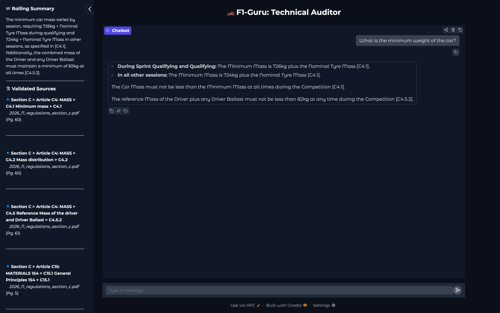

# 🏎️ F1-Guru: Agentic Technical Auditor for FIA Regulations

An advanced Agentic RAG system designed to parse, analyze, and audit the complex 2026 Formula 1 Technical Regulations with high precision and verifiable citations.


## 📋 Table of Contents

  * [📖 Project Overview](#-project-overview)
  * [📊 Data](#-data)
  * [🏗️ The AI Architecture](#️-the-ai-architecture)
  * [🧬 Evolution of the Agentic RAG System](#-evolution-of-the-agentic-rag-system)
  * [✨ Key Features](#-key-features)
  * [🖼️ UI Preview](#️-ui-preview)
  * [⚙️ Installation & Running](#️-installation--running)


## 📖 Project Overview

**F1-Guru** is not just a chatbot; it is a **Technical Auditor**. Standard RAG systems often fail when faced with highly structured legal and technical documents where context is deeply nested and rules frequently cross-reference one another. 

This project solves the "Semantic Silo" problem by using a stateful **LangGraph** architecture. It transforms static FIA PDFs into a dynamic knowledge graph, allowing for multi-step reasoning, deterministic cross-reference fetching, and faithful audit trail.


## 📊 Data

The project relies on the official [2026 FIA Technical Regulations](https://www.fia.com/regulation/category/110). Because these documents are legally dense and visually complex, a standard "text dump" wouldn't work for a technical auditor. I built a pipeline that treats these PDFs as a structured database.


### Parsing with LlamaParse
Instead of using basic PDF-to-text tools, I utilized **LlamaParse** to handle document reconstruction. This approach allows the system to recognize the actual layout of the page, which is vital for several reasons. It preserves complex power unit and points tables in their original grid format so the AI can read them accurately. It also performs surgical removal of "ghost numbers" and repetitive page footers that typically clutter vector databases. Additionally, technical diagrams and engine cross-sections are linked directly to the text that describes them.

### Handling Deleted Regulations
FIA documents often leave deleted rules in the text and simply mark them with a strikethrough. To prevent the AI from citing these as active law, I utilized a specific instruction within LlamaParse. By using a custom prompt during the parsing phase, the system identifies and physically removes any text containing a strikethrough. This ensures the Guru only learns from valid, active regulations.

### Context and Metadata
To ensure the data is self-describing, the pipeline performs two key injections.
* Every individual rule is tagged with a full breadcrumb path such as Section C > Article C4 > Rule C4.1.1
* Source filenames and page numbers are hard-coded into every chunk to provide a permanent audit trail for citations


### Smart Chunking Strategy
The data is broken down using a two-layer approach. First, I used regex to ensure every regulation becomes its own independent atomic unit. This keeps the rules whole so the context is not chopped in half. Second, for massive technical tables that are too large for a single thought, a secondary splitter handles the overflow while maintaining a 300-character overlap to keep the information connected.


## 🏗️ The AI Architecture

The F1-Guru is built as a stateful, agentic reasoning engine using **LangGraph**. Instead of a simple one-shot search, the system follows a logical path to verify information, handle technical cross-references, and ensure that every answer is grounded in the 2026 regulations.

### Technical Foundation
The system is built for strictly on-device execution, leveraging hardware-level GPU optimization to ensure the entire regulatory audit remains offline and independent of external APIs.

* **gemma4:e4b** serves as the primary reasoning model for planning, grading, and generating final responses
* **BAAI/bge-m3** is the embedding model used to transform technical text into 1024-dimension vectors for high-precision semantic search
* **BAAI/bge-reranker-v2-m3** acts as a precision layer, re-scoring retrieved chunks to ensure only the most relevant technical data reaches the LLM
* **ChromaDB** functions as the local vector store to manage thousands of atomic regulatory chunks

This setup ensures that technical terms like Mass and Weight or Power Unit and ICE are understood in their proper regulatory context.

### The Agentic Workflow
The system orchestrates several specialized nodes that work together to "think" through a query.

* The **planner_node** breaks down complex user questions into specific search tasks
* The **retrieve_node** fetches the most relevant regulatory chunks from the database
* The **grader_node** acts as a quality control gate to check if the retrieved data actually answers the question
* The **transform_query_node** rewrites and optimizes the search terms if the initial results are found to be insufficient
* The **cross_reference_node** identifies when a rule mentions another article and automatically fetches that specific cited text
* The **generate_node** synthesizes all verified information into a technical, concise response
* The **summarizer_node** manages the rolling context of the conversation to keep track of follow-up questions

 
## 🧬 Evolution of the Agentic RAG System

The project evolved from a simple one-shot retrieval script into a stateful **Corrective RAG (CRAG)** system. Standard search engines often struggle with FIA regulations because technical car specifications and sporting penalties are stored in separate sections that don't always share keywords. To solve this, I used **LangGraph** to build an agentic state machine that can reason, critique its own findings, and pivot its search strategy in real-time.

### Precision and Reranking
While vector search is excellent for finding information in the right "ballpark," it can sometimes lose the logical scent required for technical auditing. I implemented **BAAI/bge-reranker-v2-m3** as a precision layer. This reranker looks at the query and the top results together to identify the most accurate "Gold" chunks. This significantly reduces hallucinations by ensuring only the highest-quality data reaches the LLM for the final answer.

### The Cross-Reference Crawler
One of the most important features of the Guru is the ability to handle nested citations. F1 rules frequently refer to other articles, such as "Except as provided in Article C5.2." Instead of hoping the search engine finds that reference, the **cross_reference_node** uses regex to scan retrieved text for Article IDs. It then triggers a deterministic tool to fetch those specific rules from the database and injects them into the context. This bridges the gap between different regulatory sections that are otherwise disconnected.

### Breaking the Semantic Silo
Technical limits and legal sanctions often live in different "silos" within the documents. A search for "Front Wing" might find the physical measurements but completely miss the penalties for a breach. To fix this, the system uses query transformation and pivoting. If the **grader_node** sees that the initial results are only a partial match, it instructs the agent to stop looking for car parts and rethink the search terminology to focus on legal keywords like sanctions, breach, or non-compliance.

### Memory and Skepticism
To handle complex audits, the system uses an annotated state that accumulates knowledge across multiple search loops. This allows the agent to build a "case file" that combines technical data and legal penalties into a single response.
* The **summarizer_node** manages a rolling context of the conversation to handle follow-up questions accurately
* The **planner_node** breaks down broad user queries into a series of manageable technical sub-tasks
* The system is designed with skepticism and would rather admit it cannot find a specific penalty than hallucinate a wrong answer


## ✨ Key Features

The F1-Guru is designed as a high-authority technical tool rather than a general-purpose chatbot. Every feature is built to prioritize regulatory accuracy and local privacy.

### Core Intelligence
* **Agentic Reasoning** - The system uses a multi-step logic loop to plan search tasks, grade the quality of retrieved data, and self-correct if the initial search is insufficient
* **Deterministic Cross-Referencing** - When a rule mentions another article, the agent automatically triggers a tool to fetch that specific text from the database to ensure a complete answer
* **Semantic Awareness** - By using the BGE-M3 embedding model, the Guru understands the technical relationship between terms like Mass and Weight, allowing for accurate retrieval even with varying terminology
* **Professional Skepticism** - The agent is programmed to prioritize faithfulness to the documents and will admit when information is missing rather than hallucinating a guess

### Audit and Reliability
* **The Source Vault** - Every response is backed by a verified audit trail that includes the source PDF name, the exact page number, and the full regulatory path
* **Clean Data Extraction** - A specialized pipeline ensures that the AI reads clean, active regulations by surgically removing page furniture and deleted strikethrough text
* **Table and Image Anchoring** - Complex technical tables and diagrams are preserved in their original context, allowing the auditor to interpret data grids and visual engine components accurately

### Interface and Performance
* **Rolling Technical Summary** - A dynamic sidebar persists throughout the conversation to track the current audit progress and key technical context without losing the thread
* **Transparency Log** - The UI displays which specific reasoning node is currently processing the request in real-time to provide insight into the AI's "thought process"
* **On-Device Execution** - The entire system runs locally on Apple Silicon using MPS hardware acceleration, ensuring your data never leaves your machine and remains completely private
* **Professional Formatting** - Regulatory formulas and technical tables are rendered using native LaTeX and Markdown for a clean, easy-to-read audit report


## 🖼️ UI Preview

The interface features a split layout with a persistent sidebar and a main chat area. The sidebar displays a rolling summary of the conversation and a list of validated sources with page numbers and article paths. The main window provides structured answers with inline citations, linking every technical detail directly to the official 2026 FIA regulations.




## ⚙️ Installation & Running

You can run the F1-Guru locally to maintain full data privacy and take advantage of on-device hardware acceleration. 

### Local Setup
If you prefer to run the project directly, ensure you have Python 3.14 or later installed.

1. Clone the repository from GitHub
   ```bash
   git clone https://github.com/cloudwhynot/f1-guru.git
   cd f1-guru
   ```
2. Install the necessary dependencies
   ```bash
   pip install -r requirements.txt
   ```
3. Pull the required models using Ollama
   ```bash
   ollama pull gemma4:e4b
   ollama pull bge-m3
   ollama pull bge-reranker-v2-m3
   ```
4. Configure environment variables
   Create a `.env` file in the root directory. You only need to add a `LLAMA_CLOUD_API_KEY` if you intend to parse your own documents.
5.  Run the Application
    ```bash
    python app.py     # Launch the Gradio Web UI
    # or
    python main.py    # Direct Terminal output
    ```

### Docker Setup
Use this option if you want to run the auditor in a containerized environment.

1. Build the image for your architecture
   ```bash
   docker build -t f1-guru .
   ```
2. Run the container
   ```bash
    docker run -p 7860:7860 --add-host=host.docker.internal:host-gateway f1-guru
   ```

The `--add-host` flag ensures that the container can communicate with the Ollama models on your local machine. Once the container is active, the Technical Auditor will be available at `http://localhost:7860`.